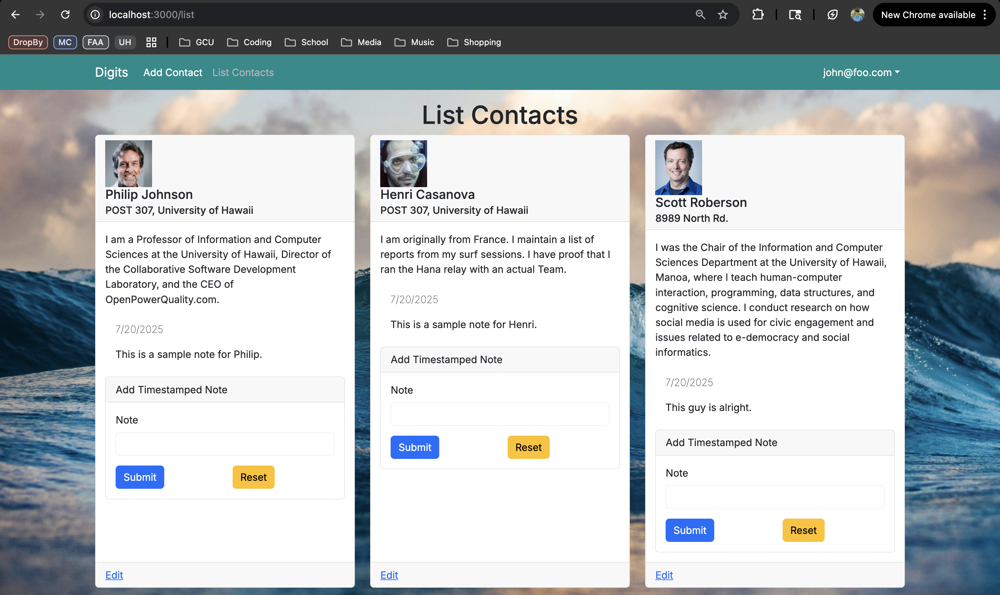

# Digits Application (ICS 314 - Summer 2025)

Welcome to the **Digits** web application! This project is a contact manager app built with **Next.js**, **Prisma**, **PostgreSQL**, and **TypeScript**. It allows users to manage personal contact lists, with optional admin capabilities for managing notes tied to those contacts.

---

## Installation Instructions

To run the app locally, follow these steps:

```bash
# Clone the repository
git clone https://github.com/elijahbrandner/digits

# Navigate into the app directory
cd digits/app

# Install dependencies
npm install

# Create and apply the database schema
npx prisma migrate dev --name init

# Seed the database with default users and contacts
npx prisma db seed

# Start the development server
npm run dev
```

## Application Walkthrough

### Sign In Page

Users can log in with their email and password. Admin users have additional privileges.

Test accounts:

admin@foo.com / changeme
john@foo.com / changeme


### Landing Page

Gives a brief overview of the app and navigation to all key areas.


### Browse Contacts Page / Add Notes

Displays all the user’s contacts, including profile images, addresses, and descriptions.
Users can attach notes to specific contacts.



### Create a Contact Page

Allows users to input a new contact with full details including image URL, address, and description.


### Admin Page

Accessible only by users with an admin role. Admins can view all contacts and their associated notes.


### Developer Notes

This app was developed for the ICS 314 Software Engineering course at the University of Hawaiʻi at Mānoa.

It follows a modern web development stack using:

Next.js App Router

TypeScript

ESLint with Airbnb Style Guide

PostgreSQL via Prisma ORM
